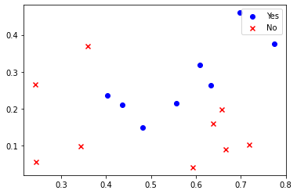

# 数据的预处理


```python
import numpy as np
import matplotlib.pyplot as plt

dataSet = np.array([
        [0.697, 0.460, 1],
        [0.774, 0.376, 1],
        [0.634, 0.264, 1],
        [0.608, 0.318, 1],
        [0.556, 0.215, 1],
        [0.403, 0.237, 1],
        [0.481, 0.149, 1],
        [0.437, 0.211, 1],
        [0.666, 0.091, 0],
        [0.243, 0.267, 0],
        [0.245, 0.057, 0],
        [0.343, 0.099, 0],
        [0.639, 0.161, 0],
        [0.657, 0.198, 0],
        [0.360, 0.370, 0],
        [0.593, 0.042, 0],
        [0.719, 0.103, 0]
])

m = dataSet.shape[0]
X = dataSet[:, :-1]
Y = dataSet[:, -1].reshape((17,1))
```

# 数据的可视化


```python
yes = dataSet[ dataSet[:, 2]==1, :-1]
no  = dataSet[ dataSet[:, 2]==0, :-1]

plt.scatter(yes[:, 0], yes[:, 1], marker='o', c='b', label='Yes')
plt.scatter(no[:, 0], no[:, 1], marker='x', c='r', label='No')
plt.legend()
plt.show()
```





# 梯度下降算法


```python
w = np.array([0, 0]).reshape(1,2)
b = 1
alpha = 0.2


for i in range(500):
    dw0 = (X.T[0, :].reshape(1,17)).dot(X.dot(w.T)+b-Y)/m
    dw1 = (X.T[1, :].reshape(1,17)).dot(X.dot(w.T)+b-Y)/m
    dw = np.array([dw0, dw1]).reshape(1,2)
    db  = np.sum(X.dot(w.T)+b-Y)/m

    w = w-alpha*dw
    b = b-alpha*db

```

# 计算预测得到结果的误差


```python
y_pred = X.dot(w.T)+b
for i in range(m):
    if y_pred[i][0] > 0.5:
        y_pred[i][0] = 1
    else:
        y_pred[i][0] = 0


error = np.nonzero(Y-y_pred)[0].shape[0] / m
acc = 1-error
print(acc)
```

    0.6470588235294117

